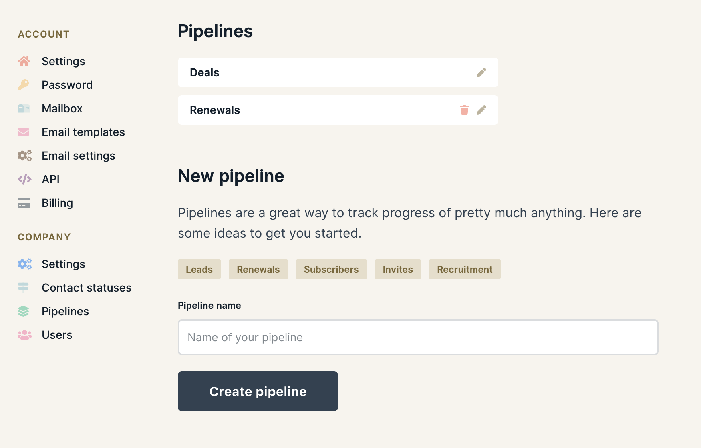

# Create a new pipeline

Pipelines are a great way to track progress of pretty much anything. You can for example use pipelines for leads, renewals, subscribers, invites and even recruitment just to name a few.

Creating a new pipeline is super easy. Just head over to **Settings &gt; Pipelines**, type in a name or click on one of the suggestions. Then click "Create pipeline" and you're done! 🎉

To edit the stages of your pipeline, have a look at [how you customize pipelines](diving-deeper/customize-your-sales-pipeline.md).




You need to be the owner of your company account to create a new pipeline


