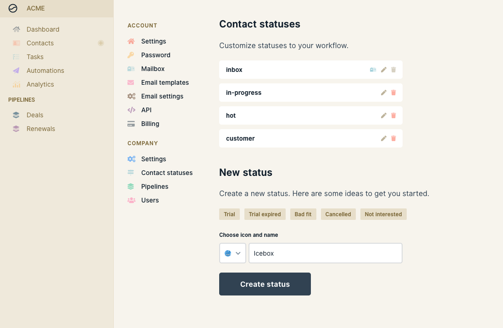

# Customize contact statuses

We've set up some default statuses for you to use when signing up for Wobaka. Of course your needs may be a bit different, and therefore we've made it super easy to customize your contact statuses anyway you like to fit your sales process.

Head over to **Settings &gt; Contact statuses** to create new and edit existing statuses.


You need to be the owner of the company on Wobaka to customize statuses



Deleting a contact statuses will also delete all contact on that status.


