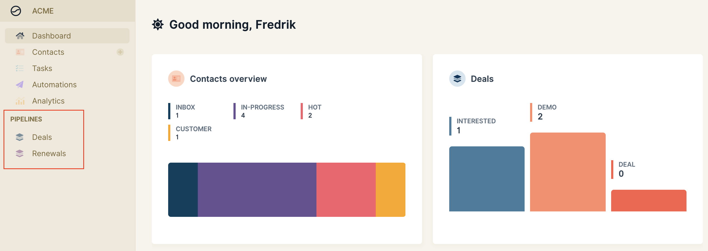
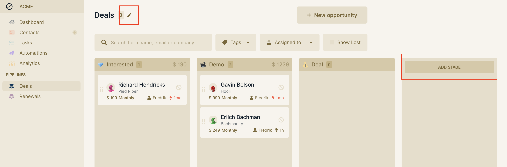
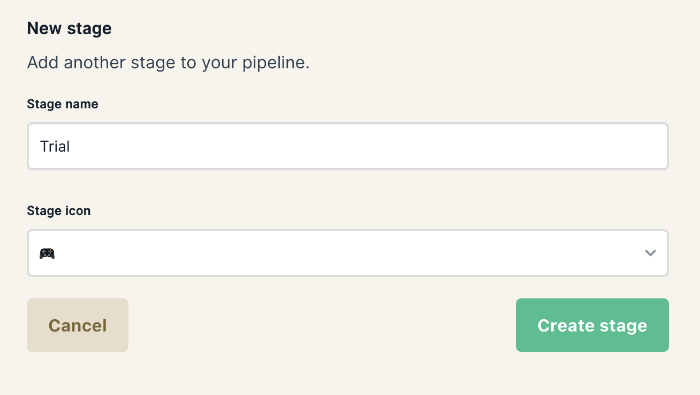
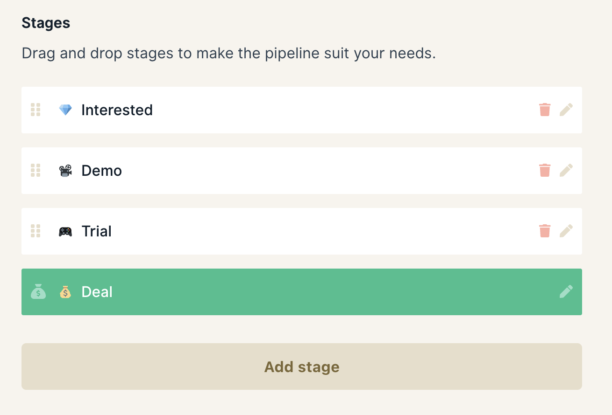

# Customize your sales pipeline

Wobaka makes it super easy to tailor your pipeline exactly to your needs. This guide will show you how to customize your pipelines.

### 1. Go to the pipeline you want to edit

Click on the pipeline that you want to edit in the navigation. All Wobaka accounts starts out with a default pipeline.

### 2. Pipeline settings

Next, click on either the "Add stage" button or the "Edit" icon next to the pipeline name to go to settings.

### 3. Customize your pipeline

Change the name of your pipeline by editing the current name in the top form.

To create a new stage, click on the "Add stage" button and fill in the name and icon you want for your new stage.

You can also reorder your stages easily by drag-and-drop. Changes will be saved automatically ✨.

