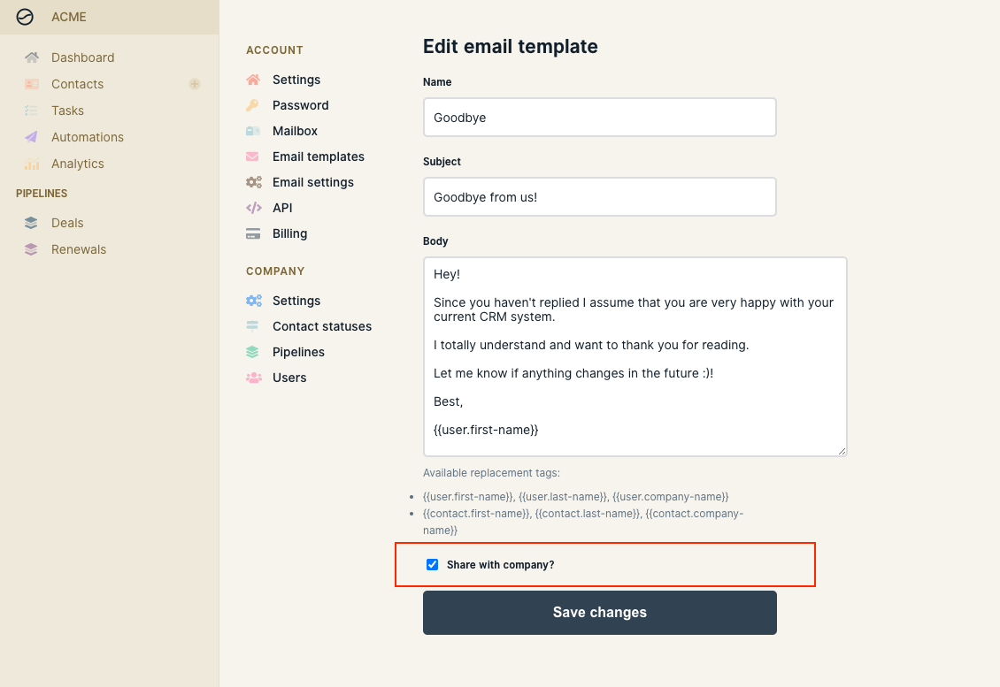

# Managing email templates

Email templates are a super useful way to create reusable emails to be used in automations and shared with your team. You can manage all your and your team's email template under **Settings > Email templates**.&#x20;

### Customize emails with merge tags

You can make highly personalized emails for your outreach campaigns by using merge tags to include your and your contacts name, company etc. The follow tags are available:

* {{user.first-name}}, {{user.last-name}}, {{user.company-name}}
* {{contact.first-name}}, {{contact.last-name}}, {{contact.company-name}}

This makes it easy to create subjects like **`MyCompany + YourCompany` ** as well as using the contacts first name and company name in your email.

### Sharing options

You can choose if you want to share your email template with the rest of your team or keep it to yourself.

