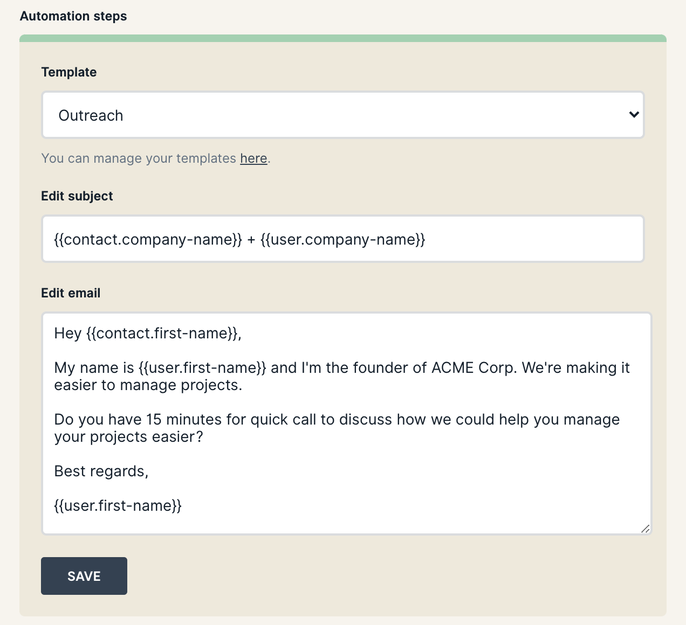

# Automate your email outreach

Email outreach takes time. Start by sending 10 emails a day and after a while you're doing 100 emails a day just to keep up with your follow ups. **We've got another idea: Set your outreach on autopilot and step back in control when it's needed.** This is how you get started.

### Create an email template

Setting up automations is much easier when you've already created a few templates to pick from. You can create and manage your email templates under **Settings > Email templates**. You can dive deeper into how merge tags work and other template features here:


[managing-email-templates.md](../diving-deeper/managing-email-templates.md)


### Setup your automation

Once you've setup your templates head over to **Automations** in the main menu and click the "New automation" button.

1. Start by picking a name for your automation. For example: Outreach.
2. Set your sending schedule by chosing if you want emails to only be sent on Monday-Friday or on all days of the week. We'll automatically account for this when scheduling the emails.

After choosing a name and sending schedule you can continue with setting up the automation steps. A step can be either:

1. Send email: This step will send an email specified by you.
2. Wait: This will add a period of waiting days which you can use to create future follow up emails.

Create a new step by clicking the buttons "Send email" or "Wait". You can use the arrows to move steps up and down in order.

### Create an email step

To create an email step, start by picking a template.

After selecting a template you'll be able to customize it further. These changes will only be applied to this specific automation and will not affect other places where the template is used.


Changing an email template will not affect automations created before the change.


### Create a waiting step

Creating a waiting step only requires you to specify the number of days the automation should be waiting before performing the next step.

### Create automation

When you've created all your steps for the automation you can go ahead and click "Create automation". Now it's ready to be sent to any contact by just clicking a button.

### Send automation to contact

Starting an automation on a contact is as easy as pressing play. Just head over to the contact, select the automation and click "Start".


Before sending an automation to a contact you need to setup email sending settings.



[setup-email-sending.md](setup-email-sending.md)


### Customize emails for sending

Once you're automation you still have the option to customize your emails for just this contact. This makes it super easy to create highly personalized outreach campaigns.&#x20;

Emails that have not yet been sent have a future sending date and will appear in blue. Just click the edit button to customize.

### When you get a reply

When someone has replied to your automation you may want to cancel future steps. This is done by clicking the check icon on the automation, which will mark it as replied. You can also do this when you get a reply after an automation has completed to change the status of the automation from _completed_ to _replied_.

Finally, you can also cancel an automation for any other reason by clicking the the cross icon. This will also delete all future steps.

That's it! We hope you'll enjoy saving hours on email outreach, every day 🚀.
