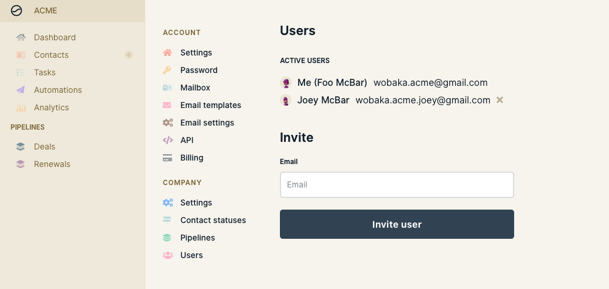
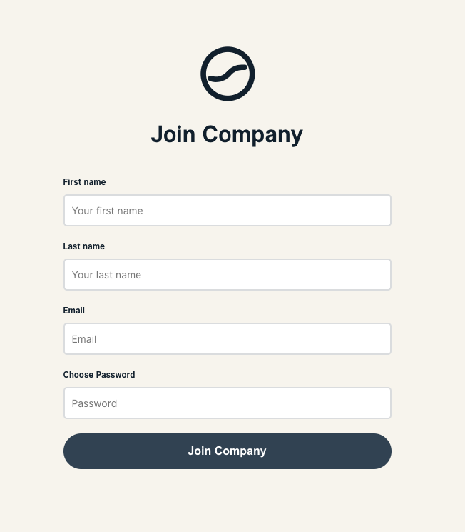

# Invite team members

You can invite as many team members as you'd like to Wobaka. It's super easy too!


You need to be the owner of your company on Wobaka to invite users


### 1. Invite a new user

Head over to **Settings &gt; Users** and enter the email of the new user.

### 2. Sign up for new account

After clicking the invite button an email with an invite link will be sent to the address you entered. Sign up for a new account with access to your company by following the link.

### What if the user already has a Wobaka account with the same email?

At this point a user may only have one Wobaka account per email.

