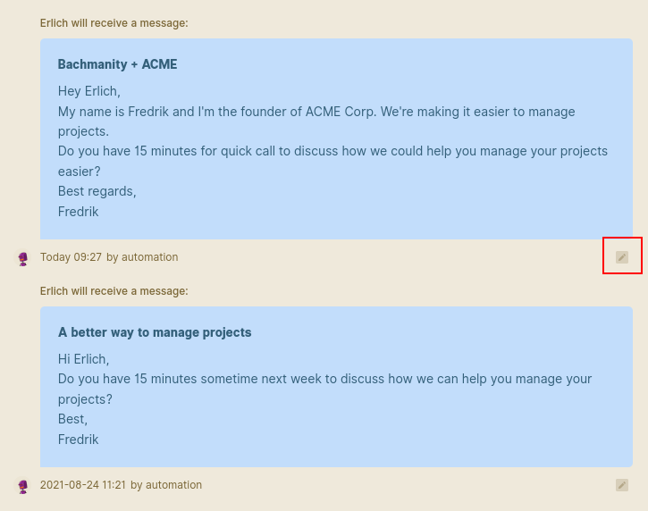

# Send bulk email automations

Bulk email automations is a great way to save hours of manual work by fully automating personalized email outreach at scale. Imagine selecting some contacts, picking a preset automation and clicking start. Cool right? That's exactly how easy it is to send bulk email sequences in Wobaka 🤙.

### 1. Select contacts

Start by selecting which contacts you want to send the automation to. You can easily apply filters and show contacts having specific tags or status. When you're done with the selection, click "Start automation".

### 2. Start automation

First you need to select which automation you want to send. You can see the details of all your automations under the "Automations" page. See the article [Automate your email outreach](automate-your-email-outreach.md) for more information about how to setup an automation.

If there're any errors at this stage, such as contacts missing a valid email address, we will inform you about what needs to be fixed before sending.

When you're ready, press "Start automation" 🚀.

### 3 \(Optional\) Customize

After starting an automation you always have 15 minutes to preview it by looking at the contact feed. This is also an opportunity to make further personalizations such as including a specific message.

### 4. Sit back and enjoy while Wobaka takes care of your follow-ups ☕


You need to [setup email sending](setup-email-sending.md) before scheduling any automations.


