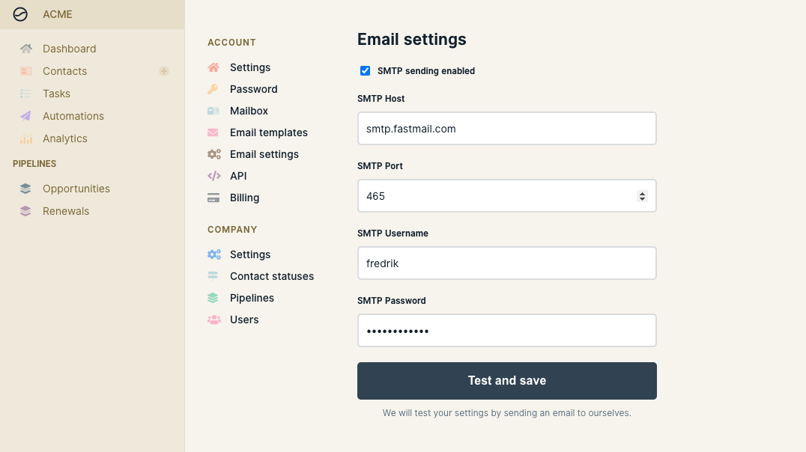

# Setup email sending

To be able to send email with Wobaka you need to set your SMTP settings. This can be done in **Settings > Email settings**.&#x20;

1. Check "SMTP settings enabled"
2. Enter your SMTP Host, Port, Username and Password

Click "Test and save". This will test your settings and if everything works you'll be notified with a success. If it doesn't work there is probably some issue with your settings/email provider.


Any email provider that supports SMTP should work with Wobaka. However some providers have limitations which makes them less reliable. **We recommend FastMail or Gmail for sending emails**.


Finding out your SMTP settings often only requires you to Google "\<Provider> SMTP settings" for example: "Gmail SMTP settings" or "FastMail SMTP settings". To make things easier, we've included guides for FastMail and Gmail below.

### Using FastMail App Passwords and SMTP

FastMail uses a handy concept called App passwords and requires all third party apps to use app passwords rather than your normal password to login. This is great because it provides additional security for you as a FastMail user.

Instead of using your normal password to login to a third party app you can create an app password in FastMail. This is done under **Password & Security > App Passwords**.

You can have multiple app passwords and choose what services they should have access to, like sending and receiving email with IMAP/POP/SMTP, contact management with CardDAV/LDAP and calendars with CalDAV. **For Wobaka, you only need to select SMTP**.

When you've chosen what access you want your new password to have, click "Generate Password" and you're good to go!

You can read FastMail's official guide [here](https://www.fastmail.com/help/clients/defineimap.html).

### Using Gmail App Passwords and SMTP

Gmail also supports the concept of app passwords and it's the recommended way to work with SMTP. As of today you need to have two factor authentication setup before using app passwords. This is easy to do and makes your account way more secure so you should definitely consider it. Follow this link to get started: [https://www.google.com/landing/2step/](https://www.google.com/landing/2step/).

After you've setup two factor authentication you can follow this guide to generate an app password: [https://support.google.com/accounts/answer/185833?hl=en](https://support.google.com/accounts/answer/185833?hl=en)

You can now use the generated password in whichever app you like.

It's often also the case that use need to enable use of "less secure apps" to allow email clients like Wobaka to use your SMTP. You can read more about it and follow the required steps here: [https://support.google.com/a/answer/6260879?hl=en](https://support.google.com/a/answer/6260879?hl=en).

### Having trouble?

Don't hesitate to send us an email at [hey@wobaka.com](mailto:hey@wobaka.com).

