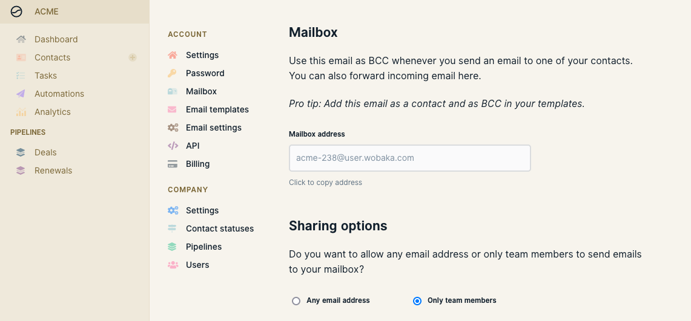
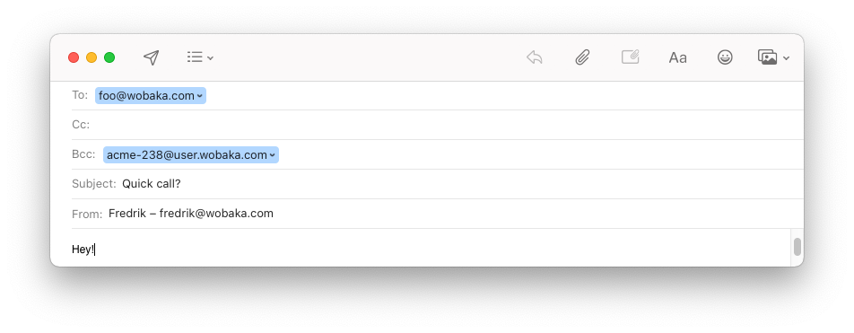
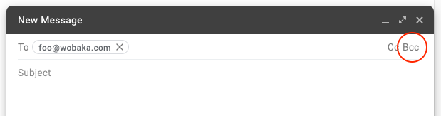

# Sync your email with Mailbox

Start sharing sales emails with your team in minutes. Just include your unique mailbox address as **BCC** or forward an email to it. Simple and privacy friendly. No inbox scanning required. This is how to get started.

### 1. Find your unique mailbox address

You can find your unique mailbox address under **Settings &gt; Mailbox**.

### 2. Add mailbox address as BCC when sending an email

Automagically save any email to Wobaka by including your mailbox address as BCC \(also called hidden copy\). The BCC field is never visible to anyone but yourself, so no need to worry about contacts seeing it.

This is what it looks like in Apple Mail.

In Gmail you may have to enable the BCC field by clicking it.

### 3. New emails will appear on contacts

Any email sent to your mailbox will appear on the corresponding contact with an email matching the receiver of your email. If no such contact exists, it will be created for you.

If you've forwarded an email to your inbox, we'll try to find the contact email from the original by parsing the email body.

### 4. Optional: Save mailbox address as contact

Add the mailbox address to your address book for easy access and autocomplete when sending emails. You can for example use the name "Mailbox" which will allow you to just type "Mailbox" and let autocomplete do the rest for you.

