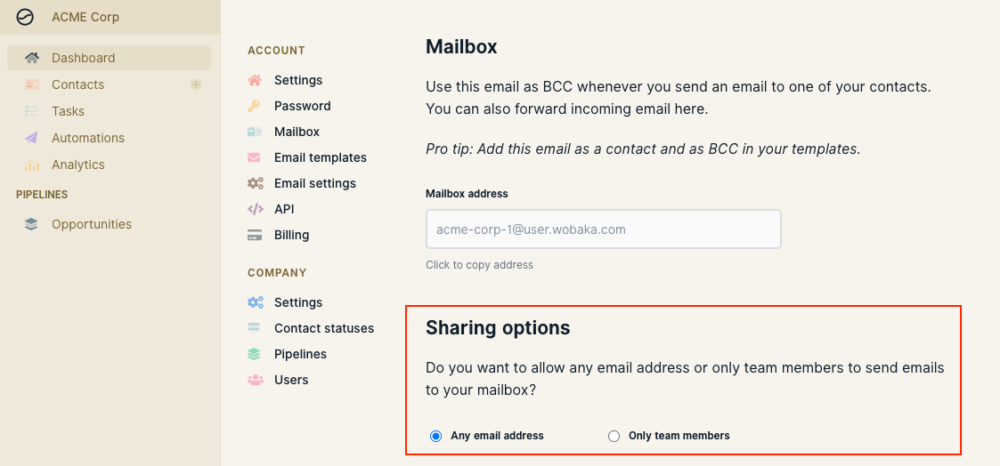

# Troubleshooting

## I'm not seeing my emails in Wobaka

Make sure that you have refreshed the page or clicked the reload button in the contact message feed. If the email still doesn't show we suggest the following.

### 1. The email has not been sent yet

Some email providers have chosen to delay email sending for a few seconds or even minutes to provide an "undo" option. This will also lead to a delay until it's available in Wobaka.

### 2. The email was sent from an unauthorized email

This can happen if you've checked the "Only team members" box in Mailbox sharing options and send the email using an address not connected to your company in Wobaka.

### 3. The email was added to an archived contact

When a new email is received Wobaka first tries to find an existing contact with that email. Sometimes, this may be an archived contact, so make sure to check the archive too.

